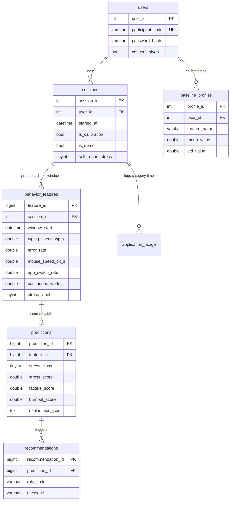

# ER diagram (Mermaid — renders on GitHub / VS Code)

```mermaid
erDiagram
    users ||--o{ sessions : has
    users ||--o{ baseline_profiles : "calibrated as"
    sessions ||--o{ behavior_features : "produces 1-min windows"
    sessions ||--o{ application_usage : "logs category time"
    behavior_features ||--o| predictions : "scored by ML"
    predictions ||--o{ recommendations : triggers

    users { int user_id PK
            varchar participant_code UK
            varchar password_hash
            bool consent_given }
    sessions { int session_id PK
               int user_id FK
               datetime started_at
               bool is_calibration
               bool is_demo
               tinyint self_report_stress }
    behavior_features { bigint feature_id PK
                        int session_id FK
                        datetime window_start
                        double typing_speed_wpm
                        double error_rate
                        double mouse_speed_px_s
                        double app_switch_rate
                        double continuous_work_s
                        tinyint stress_label }
    baseline_profiles { int profile_id PK
                        int user_id FK
                        varchar feature_name
                        double mean_value
                        double std_value }
    predictions { bigint prediction_id PK
                  bigint feature_id FK
                  tinyint stress_class
                  double stress_score
                  double fatigue_score
                  double burnout_score
                  text explanation_json }
    recommendations { bigint recommendation_id PK
                      bigint prediction_id FK
                      varchar rule_code
                      varchar message }
```
